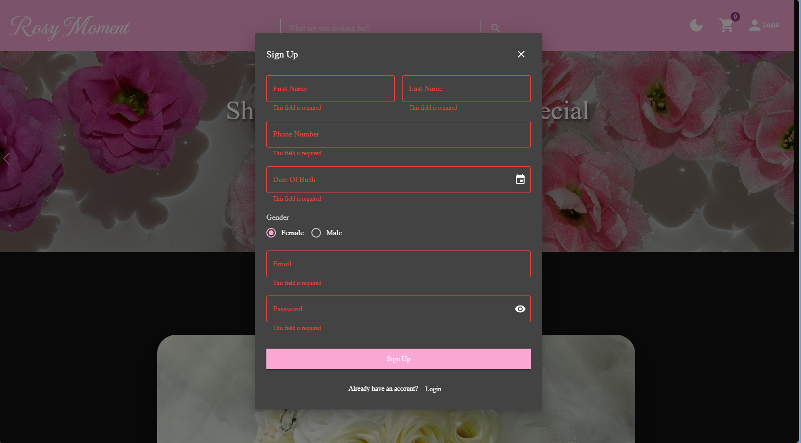
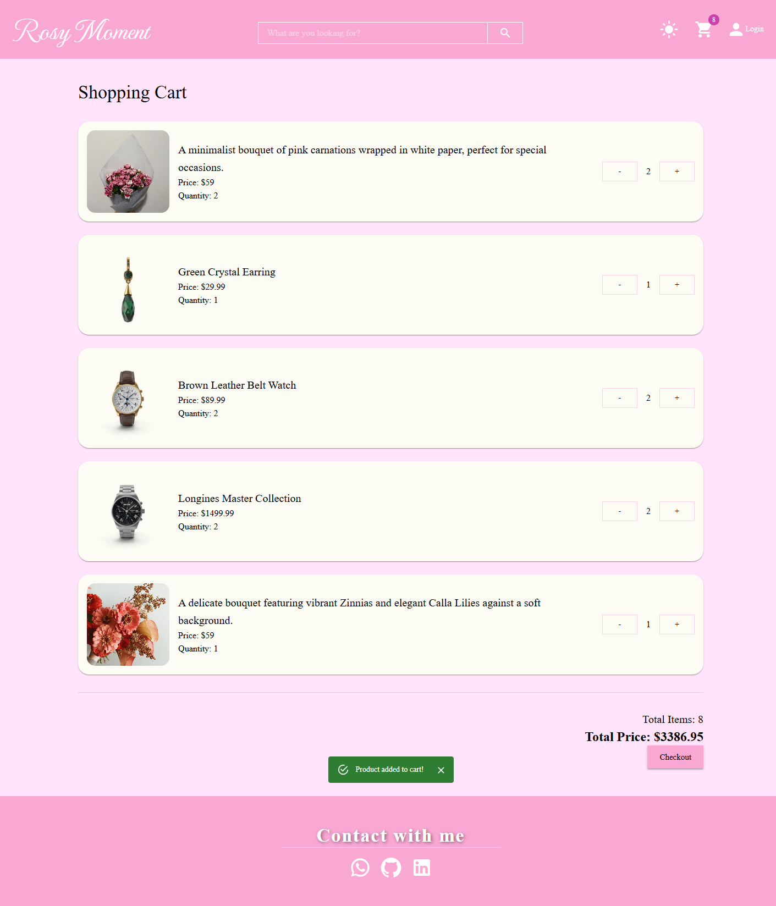
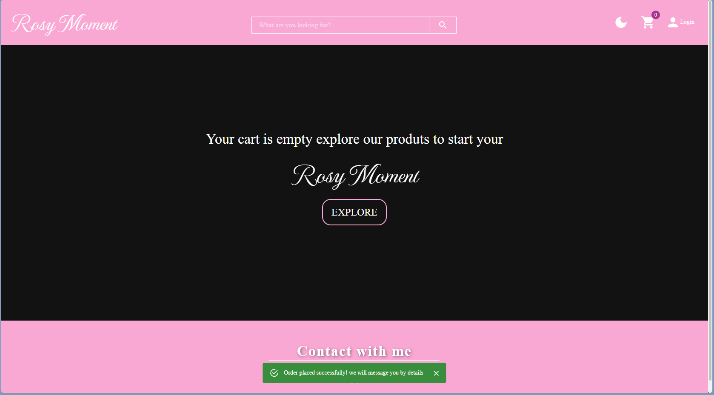
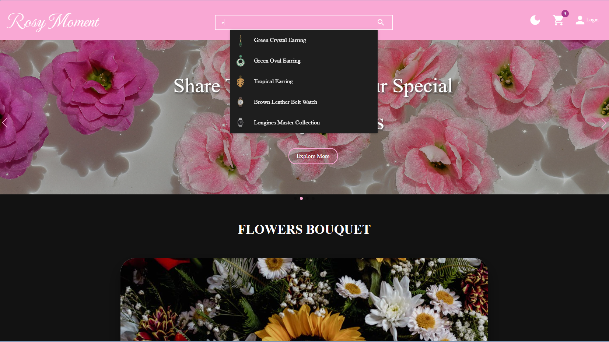
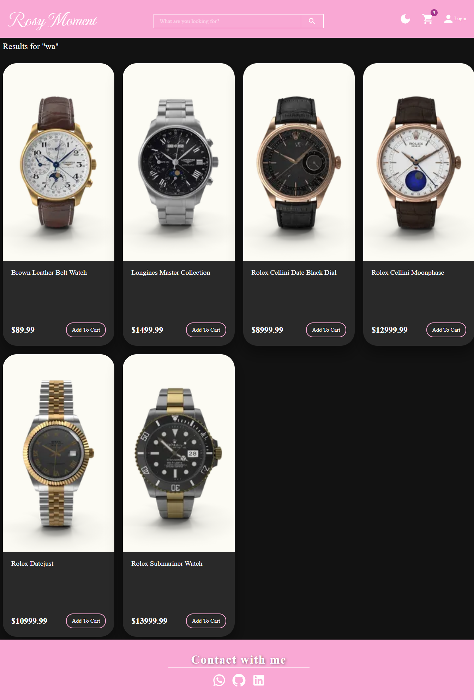

# Rosy Moment

Rosy Moment is a modular e-commerce application built with a strong focus on scalable state management, separation of concerns, and clean UI architecture.

The project demonstrates structured Redux Toolkit usage, normalized multi-source data handling, persistent cart logic, and reusable UI patterns — all designed with maintainability and user experience in mind.

---

## Live Demo

Production Build:  
https://rosy-moment.netlify.app/

---

## Architectural Principles

This project was intentionally structured around the following principles:

- Single Responsibility per component
- Clear separation between UI, business logic, and async state
- Predictable global state with Redux Toolkit
- API normalization layer to unify different data formats
- Reusable and composable UI components
- Persistent client-side state without backend dependency

Each feature is isolated, testable, and extendable without tight coupling.

---

## Core Features

### State Management

- Redux Toolkit with multiple slices:
  - productsSlice
  - flowerBouquetSlice
  - cartSlice
  - uiSlice
- Async logic implemented using createAsyncThunk
- Status lifecycle handling (idle, loading, succeeded, failed)
- Cross-slice coordination without unnecessary dependencies

#### Authentication State (Context + Reducer)

Authentication UI state is intentionally isolated from Redux and managed using React Context + useReducer.

This separation keeps global business state (products, cart, async data) inside Redux, while form-driven UI state remains locally scoped and predictable.

The custom AuthReducer handles:

- Controlled form field updates (SET_FIELD)
- Dynamic validation logic based on auth mode (login / signup)
- Password visibility toggling
- Auth mode switching (login ↔ signup)
- Field-level error management
- Submission lifecycle control
- Toast feedback state management

Form validation includes:

- Required field enforcement
- Email format validation
- Password strength rules (minimum length + symbol requirement)
- Conditional field validation depending on auth mode

This approach prevents overloading Redux with UI-only state and keeps authentication logic modular, testable, and independent from the global store.

---

### Cart System

The cart architecture is fully reducer-driven:

- Add / Increase / Decrease / Remove items
- Automatic recalculation of total quantity and total price
- State persistence using LocalStorage
- Checkout simulation with global feedback
- Immutable-safe updates via Immer (Redux Toolkit)

Cart logic is centralized — UI components dispatch actions only.

---

### API Integration & Data Normalization

The application consumes multiple external APIs:

- DummyJSON (Jewelry & Watches)
- Pexels API (Flower Bouquets)

Each API returns different data structures.  
A normalization layer unifies product shape before consumption in search and cart logic.

This prevents UI components from depending on inconsistent data formats.

---

### Search System

- Custom hook (useSearch) for controlled logic
- Query-based routing with React Router
- Real-time suggestions dropdown with keyboard support
- Enter key triggers search and dismisses suggestions
- Clicking outside the search bar dismisses suggestions automatically
- Normalized filtering across categories
- Independent search results page with improved layout

Search logic is abstracted from UI rendering.

---

### UI & Interaction

- Material UI design system
- Swiper.js for hero and product carousels with improved slide layout
- Dark / Light mode toggle using MUI Color Scheme API (v7)
- Responsive layout across breakpoints
- Loading skeleton states
- Error state rendering
- Empty state fallback when no products are found
- Snackbar-based global notifications

The UI layer remains declarative and clean — state mutations never happen inside components.

---

## TypeScript Migration

The entire codebase was migrated from JavaScript to TypeScript. Key decisions:

- Shared interfaces extracted to a centralized `src/types/` directory and colect them in index.ts to maintain "one source of truth" logic
- Most components and hooks typed with explicit interfaces
- MUI `severity` prop typed as a union type instead of `string`
- `ReactNode` used for component `children` props
- Redux hooks typed via `useAppDispatch` and `useAppSelector`
- `PayloadAction<T>` used for all Redux reducers
- API response shapes defined as interfaces before consumption
- Normalizing data with TypeScript style for clean logic

---

## Recent Improvements

- **TypeScript migration** — full codebase migrated from JavaScript to TypeScript
- **Search UX** — Enter key triggers search, blur dismisses suggestions, results layout improved
- **Flower Bouquet Swiper** — fixed incorrect image source that was displaying a strawberry instead of flower bouquets
- **MUI v7 compatibility** — removed deprecated `mode` prop from `ThemeProvider`, aligned with `useColorScheme` API
- **Empty state handling** — added fallback UI when a product category returns no results

---

## Component Philosophy

Each component is responsible for one concern:

- NavBar → Navigation + Search Trigger
- SearchSuggestions → Suggestion Rendering Only
- ProductsSwiper → Product Display Logic
- FlowerBouquetSwiper → External API Display
- Cart → State-driven cart visualization
- AuthProvider → Context-based auth isolation

No component handles logic outside its domain.

---

## Screenshots

### Home

### Products Slider

### Cart

### Search Suggestions

### Search Results

---

## Tech Stack

### Core

- React (Component-based architecture)
- TypeScript (Static typing)
- Redux Toolkit (Global state management)
- React Router (Client-side routing)

### State & Logic

- createAsyncThunk for async workflows
- Context + useReducer (Authentication state isolation)
- Custom Hooks (Search normalization & suggestion logic)
- useState, useMemo & useEffect

### UI & Styling

- Material UI (Component system + Theme customization)
- MUI Color Scheme API (Dark / Light mode handling)
- MUI System (sx prop responsive styling)
- Swiper.js (Interactive sliders & carousels)

### Data & Networking

- Axios (HTTP requests)
- DummyJSON API
- Pexels API

### Persistence

- LocalStorage (Cart state persistence)

---

## Configuration

This project requires a Pexels API key.

Create a `.env` file in the root directory and define:

VITE_PEXELS_API_KEY=your_api_key_here

---

## Installation

Clone the repository:

git clone https://github.com/leenfani/rosy-moment.git

Install dependencies:

## npm install

---

## Author

Leen Fani  
Frontend Developer
